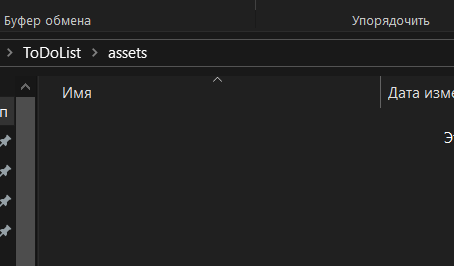

# ToDoList

ToDoList тестовое задание.

  <!-- Пример скриншота -->

## Содержание

1. [Описание](#описание)
2. [Установка](#установка)
3. [Использование](#использование)
4. [Примеры](#примеры)
5. [Лицензия](#лицензия)

## Описание

Краткое описание проекта, его функций и особенностей.

## Установка

### Требования

- Укажите, какие зависимости и инструменты необходимы для работы вашего проекта (например, Node.js, Python, .NET и т.д.).

### Шаги для установки

1. Клонируйте репозиторий:
    ```bash
    git clone https://github.com/yourusername/your-repository.git
    ```
2. Установите зависимости:
    ```bash
    npm install  # или другая команда в зависимости от вашего проекта
    ```
3. Запустите приложение:
    ```bash
    npm start
    ```

## Использование

Опишите, как использовать ваше приложение после установки. Приведите примеры команд или шагов.

Пример:

```bash
# Пример команды для запуска приложения
dotnet run
