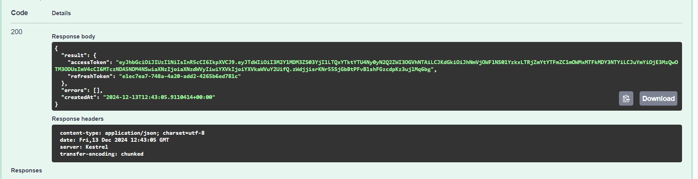

# ToDoList

`ToDoList ASP.NET backend` тестовое задание.

## Содержание

1. [Установка](#установка)
2. [Использование](#использование)
3. [Дополнительная информация](#дополнительно)

## Установка

### Шаги для установки

1. Клонируйте репозиторий:
    ```bash
    git clone https://github.com/initaIe/ToDoList.git
    ```
2. Перейдите в:
    ```bash
    ToDoList\ToDoList.Backend
    ```
3. Запустите powershell файл для создания мигарций:
    ```bash
    hard-migrations.ps1
    ```
Или запустите их в ручную в определенной последовательности:
1)
```bash
dotnet ef database drop -f -c ToDoListWriteDbContext -p .\src\ToDoList.Infrastructure\ -s .\src\ToDoList.Presentation\
```
2)
```bash
dotnet ef migrations add Init -c ToDoListWriteDbContext -p .\src\ToDoList.Infrastructure\ -s .\src\ToDoList.Presentation\
```
3)
```bash
dotnet ef database update -c ToDoListWriteDbContext -p .\src\ToDoList.Infrastructure\ -s .\src\ToDoList.Presentation\
```

## Использование

1)
> Перейдите в проект Presentation и запустите его или выполните выполните:


```bash
dotnet run
```
2)
> Перейдите на:
```bash
http://localhost:5231/swagger/index.html
```
3)
> Зарегистрируйтесь.
> Введите валидный email address. Пример: "zxc@zxc.zxc".
> Введите пароль. Минимальная длина 5, максимальная длина 64. Пример: "qwerty12345".
> Введите username. Минимальная длина 3, максимальная длина 32, можно использовать только буквы и цифры. Пример: "qwertyzxc123".


4)
> Авторизуйтесь используя данные введенные ранее.



5)
> Используйте ранее полученный AccessToken.


6)
> Теперь вы можете использовать данный функционал:


7)
> При необходимости воспользуйтесь refresh-tokens и получите новый AccessToken:


## Дополнительно

> При необходимости вы можете изменить: настройки JWTBearer, время жизни рефреш сессии и строку подключения к Sqlite в "appsettings.Development.json"

